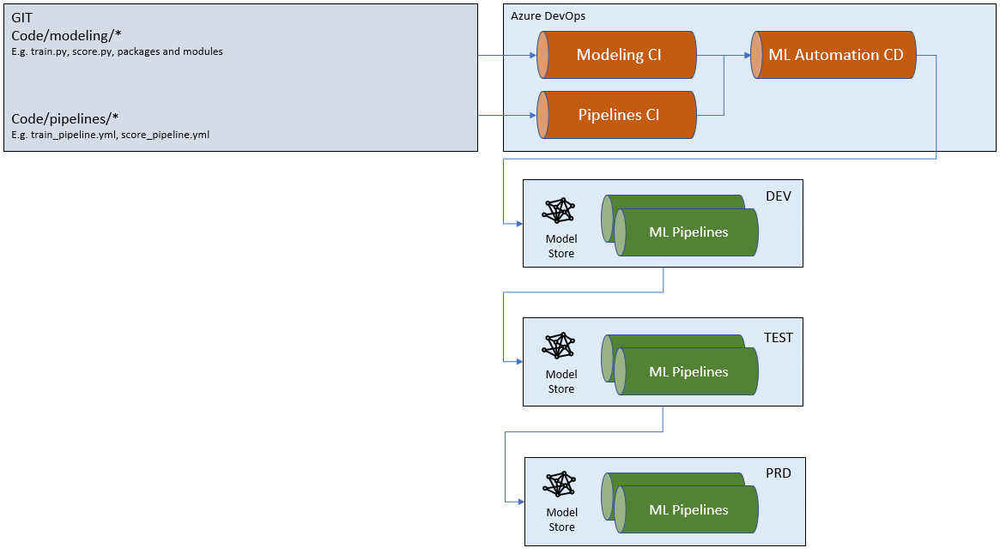

# Machine Learning Continuous Integration and Delivery

## Continuous Integration

Continuous Integration (CI) is the process of automating the build and testing of code every time a team member commits changes to version control. CI encourages developers to share their code and unit tests by merging their changes into a shared version control repository after every small task completion. Committing code triggers an automated build system to grab the latest code from the shared repository and to build, test, and validate the full master branch (also known as the trunk or main) - [What is CI?](https://docs.microsoft.com/en-us/azure/devops/learn/what-is-continuous-integration).

It is a good practice to set up continuous integration for a machine learning model to get continuous feedback on the _product quality_. In practice, some tasks may be required to run less frequently than others (e.g. the training of a ML model). Therefore we distinct between different CI processes triggered by either feature branches or the master branch.

In this folder you can find pipeline definitions for Azure Definitions to cover the below scenarios:

1. [Code Health Continous Integration](codehealth.ci.yml) - CI on Feature Branches, triggered on each commit: *Ensuring Code Quality*
1. [Model Continous Integration](ml-model.ci.yml) - CI on Master Branch, triggered on each pull request: *Ensuring Code Quality + Model Training + Model Validation + Model Publishing*

## Continuous Delivery

Continuous Delivery (CD) is the process to build, test, configure and deploy from a build to a production environment. Release pipelines help you automate the deployment and testing of your software in multiple stages.

Without Continuous Delivery, software release cycles were previously a bottleneck for application and operation teams. Manual processes led to unreliable releases that produced delays and errors. These teams often relied on handoffs that resulted in issues during release cycles. The automated release pipeline allows a “fail fast” approach to validation, where the tests most likely to fail quickly are run first and longer-running tests happen after the faster ones complete successfully. Issues found in production can be remediated quickly by rolling forward with a new deployment. In this way, continuous delivery creates a continuous stream of customer value.

Continuous Delivery is frequently a challenge for data science teams. The step of model deployment requires typically more of a dev/infra background when compared to other steps in the data science lifecycle. This is causing teams that are skewed to the analytical side in terms of their skill set, to rely on traditional SDE teams for model deployment. By owning the complete delivery process as a team, the data team can break out of their isolation, increase agility and reduce refactoring efforts.

In this folder you can find pipeline definitions for Azure Definitions to cover the below scenarios:

1. [ML Continous Delivery](ml.cd.yml) -  on Master Branch, triggered on each pull request: *Ensuring Code Quality + Model Training + Model Validation + Model Publishing*

The below shows a graphical overview of the configured build and release process.

