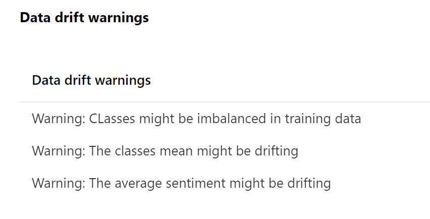
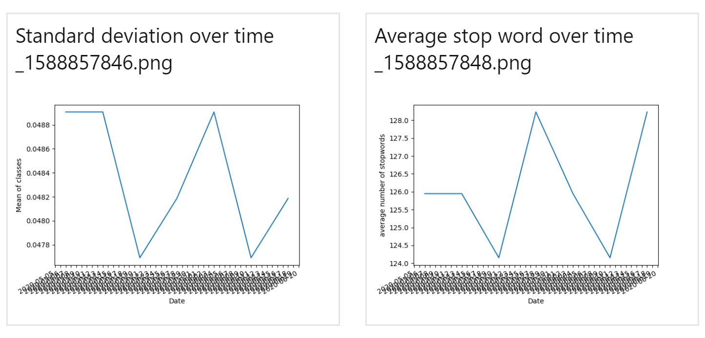
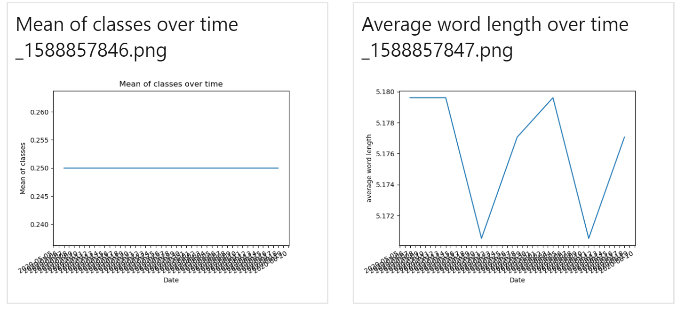
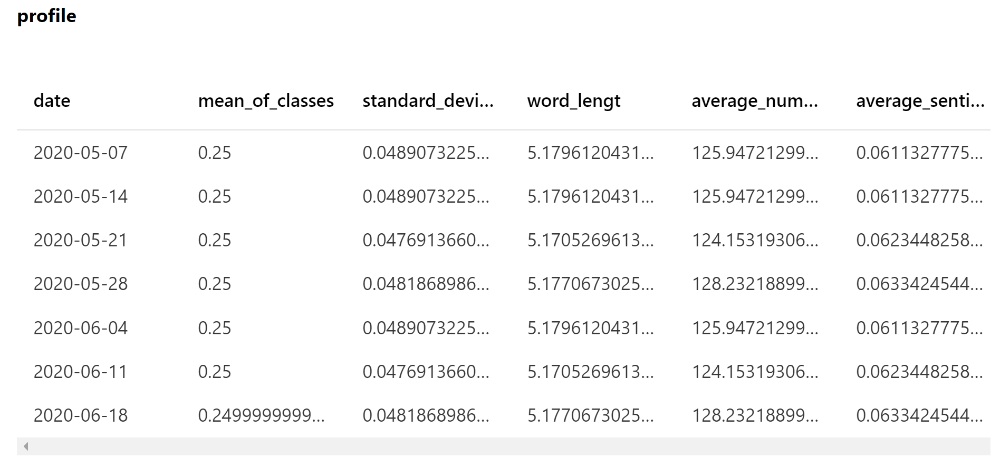

# Data validation and preparation

An very important part of MLOps is data validation and data validation over time. We want to make sure if we automate the process of re-training that our data is not drifting (or at least we want to be aware of drifts) and that the data is not biased. More basic validation like if the format of the data is still as expected or if there are any missing values present are also important to validate. 

We understand why bias is bad for model training, but I think it is important to point out why data drifting is important to be aware of. Of course, data drifting is not necessary a bad thing. It is something that we are expecting. That is also part of the reason why we retrain our model occasionally, to reflect the new incoming data as well. However, what I see at most customers, is that the have model validation after they trained the model. Within model validation, customers often check if certain parameter are within a certain bandwidth. When this happens, the model validation will fail. However, as we can imagine, if the data changes a lot, these parameters are expected to go out of bandwidth. As I do recommend to let you model fail when this happens, it is recommended to have a data profiling report ready that can explain these failures.

Therefore, I would recommend to build a baseline profile of basic and more advanced statistics of your dataset, that you found when exploring the data, and every time you retrain your model, validate if your new data is within a certain interval of these statistics. I would recommend building a small report of warning and output this to the blob storage. I would also recommend to build a small dataset of all these statistics over time. This way, you can you Power BI for example, to create reports and profiles of your data and check and guarantee data quality and transparency. Here is an example of folder structures for examining data:

This folder contains scripts for data validation and data preperation. In  this folder you will fidn three python files and three python submit files for submitting the scripts to AML.

* data_engineering.py

    In this file we will transform the raw data comping from Sklearn 20newgroups to prepared data ready for training. Data engineering steps that we take include making all words lower case, remove punctiation and remove digits. (Note that these are very basic data transformations for demo purposing. For better model results and cleaner data consider adding data preperation steps.) The data_engineering_submit.py file contains the code to submit the data engineering process to Azure Machine Learning.

* data_validation.py

    In this file, new data that comes in will be validated against a baseline profile. In the demo we have created a baseline profile [here](https://github.com/miquelladeboer/aml-mlops-workshop/blob/master/code/data%20exploration/data_validation.py). In this file, we will calculate some basic statistics and check if they fit into the interval of the baseline profile. A warning report is created and logged to Azure Machine Learning and to blob storage, so we can monitor potential data drift. Within this file there are also some data quality checks that will generage an error, like empty values for example. This baseline profile is a static profile that might only change every month or when nessacry and only on manual command. We can create report like:

    

* create_historic_profile.py

    In contrast to the baseline profile, that we will use for validation, we also want to keep track of the statistics of the data every time we update the data with a new dataset. This can for example happen every week when we want to retrain our model with current data. For data quality checks an transparancy, we want to log over time, how our data profile is changing. This way we can easily monitor if data is drifting, detect trends and explain shifts in model parameters or model performance. This historic profile is saved in a blob storage and can be used for reporting in Power BI.

    
    
    

## Data preparation
In many cases, a lot of the data preparation is done by the data engineer. However, for the ML purpose the data still needs to be transformed for better and logical model results (logs, abs values, etc..), new features need to be created, categories need to be one-hot-encoded or data need to be indexed. All these steps are ML model specific. Therefore I would recommend to do these steps within a data science project (e.g. data engineering within the project and within the ML pipeline) instead of having this done in another place by a data engineer. These data transformations can of course still be done by a data engineer, but I will advise to perform these steps within a ML project as it is part of the ML lifecycle.

