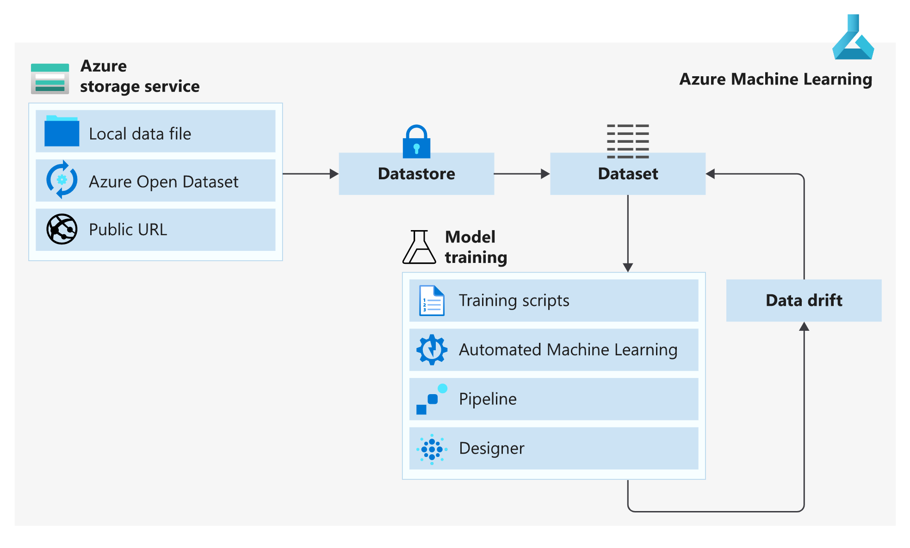

# Data Movement helpers
This folder contains some scripts for the initial set-up of the enviroment.

* load_data_from_web.py 

    Helper file to load raw data from sklearn   20newsgroups to your local outputsfolder: "outputs/raw_data". (Use this folder if you want to have your data locally for exploration or debugging using the raw data.)

* load_data_to_cloud.py 

    Helper file to load raw data from sklearn 20newsgroups to the default blobstorage of your workspace.

* define_dataset_raw.py

    Helper file to define the dataset that refers to the raw data in your blobstorage. Note that in line 6, you need to replace te start date to the current week or the week you start.

* define_dataset_prepared.py

    Helper filde to define the dataset thet refers to the prepared data in your blobstorage (note: you can only set up this after you have prepared data in your blobstorage. To do that, run first the data_engineering_submit.py with parameters, data_local = 'no' and subset = 'no' and for  data_local = 'no' and subset = 'yes')

# Data Management (Datasets)

We have already discussed how we can connect our AML to a storage account. But what I see at most customers, is that they add an extra layer on top of the datastores. This layer is called a dataset. 

 

I will briefly explain the concept and need for datasets. In many cases, a datastore, like a blob storage will receive new data every hour/day/week or so, so data in constantly streaming in. However, when creating a ML model, we usually take a snapshot of the data for training the model, and we only retrain the model every week/month/when triggered. Therefore, the data that is used for training the model, is not consistent with the data that is in datastore. Datasets is a concept that is in essence a metadata framework about the data used in training. When using datasets, you can specify exactly the data used for training and keep track of multiple versions of your dataset. In this way you have full lineage of the data used in training. This can be very useful when question arise about bias and transparency. I would highly recommend to make use of datasets when using AML for training you model.

When you upload data to the service, you should get something like this:

 