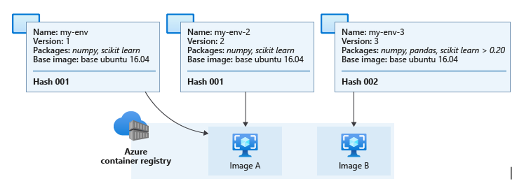
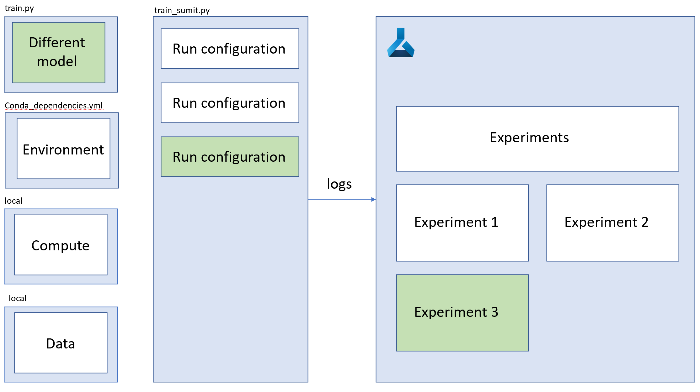
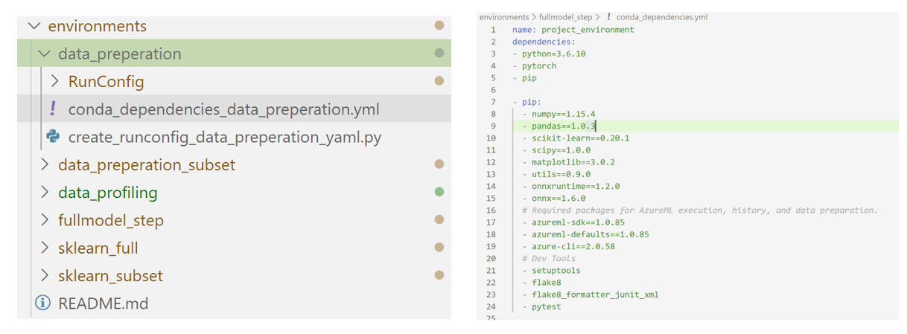

# Run Configurations

## Managing environments
When developing ML models at scale, it is very important to manage your conda environment correctly. Especially if you are working with multiple people on the same projects. It is even more important to manage your conda environment during local training as you will need the exact environment when training on a AML cluster or when you deploy your model for inferencing. The solution might fail if you use a different version a certain package. 
It is also very important to work in a structured way when managing these environments. Especially if the project grows larger and when you add more steps to the solution, you might want to use different environments for different parts of the solution. To go back to the example I gave during ‘choosing the right compute’, I might have for the same steps different environments. For example, if we are preparing the data, I might use libraries as Dask or Fastparquet, whereas in model training I might need a Pytorch framework or onnx runtime. 

## Run configurations
If we combine the different environment, different datasets, and different compute together with the different training scripts, I can create a configuration file. This configuration file will sent an experiment to the AML service as explained in the following picture:
 
 By using different models, different environment, different compute or different data, we can create different run configuration files that will result in different experiments:
  
  As we have seen from the example, certain data, compute, environments, and models result in a specific run configuration for different steps of the training. I would recommend storing these run configurations in a structured matter, so it is easier to reuse and share across the organization. This will help you with speeding up the process of development. An example in your code base could look like this:
  
  Where I have different YAML files within every environment, like the one for a neural network.
Best practise is to create YAML files for your run configuration. Azure DevOps pipelines has chosen the direction of working with YAML files for building pipelines. It is therefore recommended to also build the Azure Machine Learning pipelines and configurations with YAML.

This folder contains configurations for different steps of datapreperation, hypertuning and modeling. These run configurations consist of:
* Conda dependencies file 
* Compute target
* Data sets
* Framework (e.g. Python, Pytorch, Tesonflow, Keras ect.)

As we can understand, for each part of the progress we might need slighly different run config files. For example, we want to do hypertuning only on a subset of the data to save time/money ect, but want to train the full model on the enitre dataset. We might want to use different compute as well for different parts in the process. For example, we might want to do our heavy data transformations on a sprak cluster for distributed data tranformations. But to train our full model, we might want to use gpu compute to imrove the training performance and fit all the data and the model on one cluster. We might also use different conda dependencies in different situations. For example, if we are preparing our data, we might want to use libraries as Dask or Fastpparquet, whereas in model training we might need a Pytorch framework or onnx for model packaging. In order to make our ML steps as clean as possible, we create seperated config files, that only contain the configuration setting needed for a specific ML step.

## Configure the run configurations

In this example we make use of different run configuration files:
* data_preparation_subset
    * Condadependencies file: conda_dependencies_data_preperation.yml, including dask, pysprark, azureml-sdk[notebooks]
    * Compute Target: Small AML compute
    * Data sets: subset
    * Framework: Python
* data_preparation, including dask, pysprark, azureml-sdk[notebooks]
    * Condadependencies file: conda_dependencies_data_preperation.yml
    * Compute Target: Spark cluster
    * Data sets: entire
    * Framework: Python
* sklearn_subset
    * Condadependencies file: conda_dependencies_sklearn.yml, including sklearn and matplotlib
    * Compute Target: 1 cpu cluster
    * Data sets: subset
    * Framework: Python
* sklearn_full
    * Condadependencies file: conda_dependencies_sklearn.yml, includigng sklearn and matplotlib
    * Compute Target: 1 cpu cluster
    * Data sets: entire
    * Framework: Python
* fullmodel_step
    * Condadependencies file: conda_dependencies_fullmodel.yml, including onnx and onnxruntime
    * Compute Target: 1 cpu cluster
    * Data sets: entire
    * Framework: PyTorch
* data_profiling

* data validation

