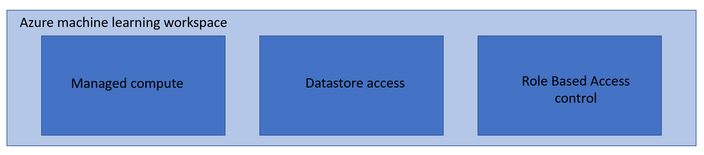
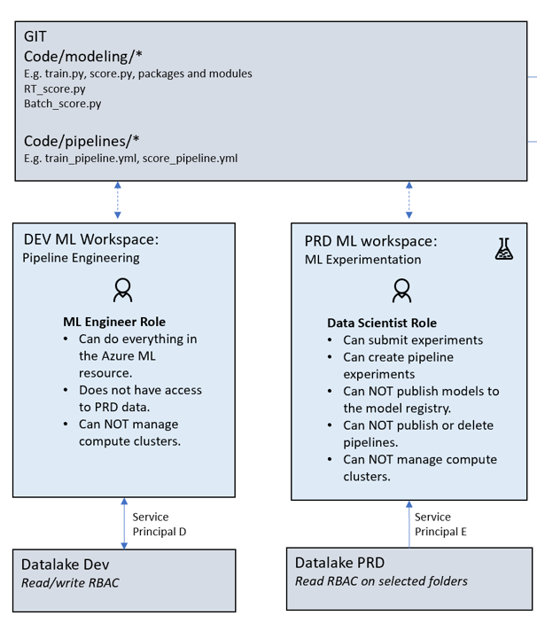
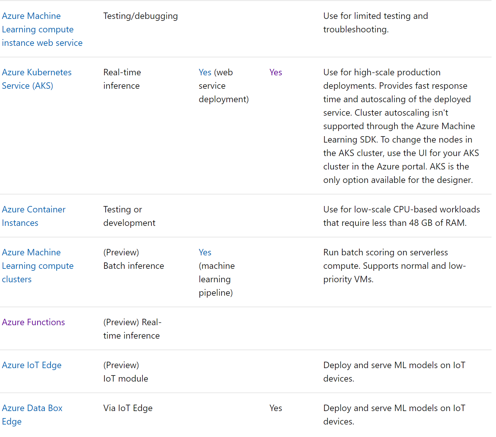

# Infrastructure as Code

This folder contains examples for how to bootstrap your machine learning workflow.
Azure Resource Manager (ARM) templates & Azure ML CLI commands can easily be used to bootstrap and provision workspaces for your data scientists prior to enabling them to begin data preparation & model training.

* **[ARM-Templates](arm-templates)** contains infrastructure-as-code templates and parameter files for two sample environments (dev + test). The use of ARM templates gives you the most flexibility in customizing your Azure resources.
* **[Scripts](scripts)** contains Azure CLI scripts for resource deployment. The use of CLI commands for deployment provides the most lean way to deploy resources to Azure.
* **[Build-and-Release](build-and-release)** contains pipeline definitions for Azure DevOps to automate infrastructure roll out. Included moreover is a PowerShell script that can be used for test deployments of the infrastructure resources.

## Automated roll out of infrastructure

In this section you will learn about how you could use [Azure Pipelines](https://azure.microsoft.com/en-us/services/devops/pipelines/) for the automated deployment of infrastructure. This way of working enables you to incrementally deploy changes to your resources, stage the changes over different environments, and build confidence as your system growths more complex.

### Getting started

Complete the below steps to set up your pipeline for infrastructure roll out.

* Navigate to [Azure DevOps](http://dev.azure.com/) and create a new organization and project. You can also re-use an existing organization and/or project.
* Create a new [service connection](https://docs.microsoft.com/en-us/azure/devops/pipelines/library/service-endpoints?view=azure-devops&tabs=yaml) in Azure DevOps of the Azure Resources Manager connection type. Azure DevOps will authenticate using this connection to make deployments to your Azure Subscription.
* In [deploy-infra.yml](build-and-release/deploy-infra.yml) replace `<your-service-connection-name>` by the name of the service connection that you created in the previous step.
* Some Azure resources require you to use globally unique names across Azure. This holds for example for storage account resources. Adapt resource names in the ARM parameter files to a name that is globally unique. Note that you should update the parameter files for the ML workspace and ML compute resources as well once you update the names of the underlying resources.
* Make a test deployment using the provided powershell script `deploy-infra.ps1`.
* Set up a new pipeline in Azure DevOps with the option to re-use an existing template. Point to the pipeline definition [deploy-infra.yml](build-and-release/deploy-infra.yml) in your repository.
* Run your pipeline from Azure DevOps. On completion, you should see a result like the below.

### Best practices on customizing the templates for your environment and team

* Many teams already have existing resources in their Azure tenant for e.g. Keyvault and Application Insights. These resources can be re-used by Azure Machine Learning. Simply point to these resources in the [Machine Learning Workspace template](arm-templates/mlworkspace/template.json). For ease of modification, we have provided separate templates for each of the resources in this repository.
* In most situations data already resides on existing storage in Azure. The [Azure CLI ML Extension](https://docs.microsoft.com/en-us/azure/machine-learning/reference-azure-machine-learning-cli) allows for a lean way to add storage as a [Datastore](https://docs.microsoft.com/en-us/azure/machine-learning/concept-data) in Azure Machine Learning. The [Azure CLI task](https://docs.microsoft.com/en-us/azure/devops/pipelines/tasks/deploy/azure-cli?view=azure-devops) in Azure DevOps can help you to automate the datastore attachment process as part of the infrastructure roll out.  
* Many teams choose to deploy multiple environments to work with, for example DEV, INT and PROD. In this way infrastructure can be rolled out in a phased way and with more confidence as your system becomes more complex.
* As one rolls out additional infrastructural resources, it becomes valuable to stage changes across the different environments. You could consider to run a set of integration or component tests before rolling out to PRD.
* It is a sound practice to protect the roll out of changes to PRD from originating from branches other than master. [Conditions](https://docs.microsoft.com/en-us/azure/devops/pipelines/process/conditions?view=azure-devops&tabs=yaml) in Azure pipelines can you help to set controls like these.
* One could specify a security group of users that require to give their [approval](https://docs.microsoft.com/en-us/azure/devops/pipelines/process/approvals?view=azure-devops&tabs=check-pass#approvals) to make roll outs to specific environments.
* It is important to note that in the MLOps way of working, we make a separation of concerns between the roll out of infrastructure and the roll out of ML artifacts. Hence the two types are rolled out at different moments and with different automation pipelines.
* Multiple additional security controls (virtual network rules, role-based access control and custom identities) can be applied on the Azure resources that are found in this repository. Controls can be added directly from the ARM templates. Consult the [documentation](https://docs.microsoft.com/en-us/azure/templates/) on Azure Resource Manager to find the possible modifications that can be made to each Azure Resource. As an example on modifications for the template for Azure ML compute, one can find a [template](arm-templates/mlcompute/template-vnet.json) in this repository that adds a SSH user and virtual network controls to the managed compute virtual machines.

# Best practises to organize your workspaces 

* Infrastructure configuration
* Shared resources across Workspaces
* Workspace organization 
* Infrastructure deployment

## Infrastructure configuration
Before we start working with the Azure Machine Learning workspace, there are infrastructure decisions to be made. The following pictures shows the infrastructure component of the Azure Machine Learning workspace: 

Within the Azure Machine Learning Workspace, there are three big decision to be made:

## Who has access to the workspace.
Best practice is to use Role Based Access Control, to grand user access to the workspace. There are three roles available in AML, as in many Azure services, owner, contributor and reader. This is an overview of the standard roles:

In my opinion, these standard roles to not suffice in most enterprise scenario. As a Data Scientist working in the Machine Learning workspace  I should be a contributor, so I can run experiments, create images, attach compute to a run and connect to the data stores. But as a standard contributor, I am also able to create my own compute and create workspaces and deploy models. In most enterprise scenario’s I see that for security/management and cost reason, the data scientist are not allowed to create their own workspaces or compute. And is most scenario’s you only want to be able to deploy models via Azure DevOps, where is will follow the standard dev practices of dev/test and prod environments and model CI/CD. Within Azure Machine Learning you can cerate your own custom roles. Custom roles can have read, write, or delete permissions on the workspace and on the compute resource in that workspace. You can make the role available at a specific workspace level, a specific resource-group level, or a specific subscription level. Best Practice is to not allow data scientist to create new workspaces or compute but let them ask permission through the IT department.

## Data configuration. Which data can be used by the workspace?
Within Azure Machine Learning, we can make connections to Datastores in Azure, for example, to a data lake storage. Within Azure Machine Learning we can connect to multiple data sources. The recommended usage of datastores and datasets we will discuss later. For now, it is good to notice that everyone in the Azure Machine Learning workspace has access to the data that is connected to it. Therefore, when deciding how many workspaces you are going to create, for what purposes and for which usages, I would recommend to be the access to certain data the leading factor. What I mostly see at customers, is that they have a workspace for each solution in each location. This, because most data is protected on a database level also per solution area and per geographical location. Because every individual with access to the Azure ML workspace, has access to the datastores connected to the workspace, it is very important for security reason that this is designed properly and before we start deploying the infrastructure.

## Managed Compute Configuration
Within every workspace, you can make AML compute available for the users within the workspace. Every user within the workspace has access to all the compute. Therefore, it is also very important to think about the available compute within a workspace and how users may use these. What type of compute, how many cores and many different clusters you need in a workspace varies of course widely per scenario. My advice would be to start with a minimum requirement of compute and scale out on request when needed. In most cases, it is also advisable to make sure to code that data scientist write is designed for parallel execution. In many cases, I see customers scale out compute to distribute the workload, while their code or data structure is not parallelizable. This is of course a waste of money. I think it is also good to mention, that the compute needs change over time as a project evolves. What I see a lot happening, is that data science teams start with small, cheap compute clusters (1 or 2 cores) per user in the workspace, for quick experimentation and code development. When the code base is more mature, the teams switch their 6 low cost clusters for maybe 1 or 2 bigger clusters with more memory and cores for example, to scale their solution on the entire datasets or to parallelize the training, in order to save time. My recommendation would be, that if you are in an experimentation phase of the project, you start with many small compute to speed up the development process, and move to more expensive compute with the optimized memory and runtime when scaling the solution.

## Shared resources across workspaces
To work with MLOps and Azure Machine Learning, we need some extra PaaS solutions. These solutions include:
* ML Key Vault
* Application Insights
* Container Registry
* Workspace storage Account

Every workspace in AML can have their own recourses, but I believe it is best practice to share these resources across workspaces as showed in the following picture:

What I see most of my customers do, is that they create 1 Resource Group in Azure for Machine Learning purposes per geo location. Within this resource group, they create multiple Azure Machine Learning workspaces, all designed for different solutions. All these workspaces share the same resources mentioned above. This way, you make it more accessible to share environment/models/metrics across workspaces. They create a separate Resource Group for the management of the ML resources, because this is mostly done from 1 place, where the management for all Azure resources happen.
By using Application Insights and Azure Key Vault across workspace, we create one place for the management of all resources in Azure.
By using the default storage account across workspaces, users can easily share models as .pkl or .onnx files, use common metrics, metadata or feature schemas.
We use Event grids, Azure functions and logic apps across workspace to put actions on events happening in AML workspaces, like triggers when a job fails, or the filtering of certain logs.
By using container registry across workspaces, user can share and reuse already build environments. This way you can lower the costs of container registry, limit the time waiting for new images being build and promote the sharing of recourses. 

## Workspace organization 
We have already discussed this a bit int the previous sections, but as a summary, I believe it is best to create workspace according to the access level of data. Because every user in the workspace has access to all the data that is in the workspace, I think it is most advisable to have only projects that require similar data use the same workspace. This is of course completely dependent on the security requirements of the company. I believe that it always in the best interest of the project if data scientist can have access to as much data that is possible and needed. But, especially in enterprise organizations, limiting the access to data is important and should be leading in designing the infrastructure.
Infrastructure deployment
As it is with all resources that we deploy in Azure, it is always bets practice to use ARM templates. Moreover it is always bets practice to work with multiple environment when deploying solutions. 
 
As we can see from this picture, it is best practice to work with DEV, TEST and PRD environment. Similar to normal DevOps practices, we allow only changes in the PRD environment through Azure DevOps.
What we also see in this picture, is that we have multiple release cycles within the ML lifecycle, namely:

* ML workspace and infrastructure deployment
* Model deployment
* Pipeline deployment

For now, we will focus on the infrastructure deployment, and later in this document we will focus on the model and pipeline deployment.
As mentioned above, the platform infrastructure is following a standard DevOps deployment structure:
 
Changes in the infrastructure are made in dev. These changes can be anything from provisioning new compute to an AML workspace or attaching a new Datastore to an AML workspace to changing the Azure Data Factory Pipeline or adding new Data Transformation Pipelines in Azure Databricks.

Best practice is to have the infrastructure of the whole ML project owned by IT. It is very important that the infrastructure is managed in one place as all PaaS solutions relate to each other. For example, the data science team expects data to come in a certain format. If the data engineer changes the data format in Azure Databricks, the solution can potentially break.
Infrastructure as a code

Azure Resource Manager (ARM) templates & Azure ML CLI commands can easily be used to bootstrap and provision workspaces for your data scientists prior to enabling them to begin data preparation & model training.

## Working with multiple environments
As is standard in DevOps practices, we work with multiple environment DEV, TEST and PRD. Normal practice is that applications are being developed in DEV with DEV data, are being tested in TEST and only deployed to production via Azure DevOps if all test are passed.

Working with a ML project, this process becomes a bit more difficult. The reason for this, is that most data scientist need access to production data when developing ML models. This Is because they need the full data to get the right statistics, spot outliers, detect biased, but also to build reliable models with enough training data. In this case Data Scientists cannot develop their models in a DEV environment, but in a PRD environment.  The ML engineer however, who is designing the ML pipelines is able to design the pipelines with DEV data, as they only need small sample data to test the solution. This will result in the following structure:

As we can see from this picture, the Data Scientist is restricted to publish models and pipelines or mange any of the compute. This is very important as they are working in a PRD environment.
The next part is to set up the Azure DevOps automation pipelines to deploy the new models or pipelines after a new commit is made to master. As discussed in the previous section, the CI is for both modeling and pipeline development and the CD is done for the produced model as illustrated here:

Lastly, we need to deploy the published model from the model CD into the different environments. We also have a separate deployment cycle of the pipeline that we want to publish in production for retraining, as we have introduced in a previous section.
The “strange” thing that happens here, is that the Data Scientists were working in a PRD environment to develop their models, but the actual deployment of the model will be tested again first in a DEV environment. This is highly recommended to do as you do not want your models directly to be deployed in PRD as they have a change to break your application.

The last thing to notice, that makes this process different from standard processes is that the ML pipeline for retraining that is in production, is also able to produce a new model that needs to be published and deployed. Even though there is only a very small change that the model produced by the retraining pipeline will break the application, we still want to make sure it will follow the same steps of deployment to avoid breaking the application. It could happen that if you retrain your model, you have used more data and therefore created a bigger model (e.g. more nodes/arcs and weights in your neural network) that will not fit on the AKS cluster you used for deployment. This will then break your app. Since the machine learning pipeline did not change any code in master on git, the produced model will go directly into the model CD. To set this trigger you could use an Azure Function app.

# Choosing the right compute target.
Azure ML offers different types of compute for different usages. The picture below gives you an overview of the different types of compute.

##  Compute instance
AML offers compute instances for code development. These VM are notebook based and contain all common packages used by data scientist. These Compute Instances are an easy way to demo or get started with AML, but in my opinion, these compute instances are not designed for ML at scale. For code development I would recommend using VScode either on local machines or within Virtual Machines. You could opt for local machines, because this is the cheapest solution. However, local machines might not be sufficient for certain memory and RAM requirements. Moreover, it might not be following company guidelines, as data needs to reside on the local machine. The second option is to use Virtual Machines to work in. This is the most save way and allows you to choose the right VM size. However, there are logically cost associated with VM’s. An even more comprehensive solution is to use Data Science Virtual Machines. These machines include all tools and framework data scientist need. This way, you do not lose any time to set up environments, you can make sure all data scientist use the same tools and frameworks and you can easily scale out the solution. Everything that is included in the DSVM can be found here:
https://azuremarketplace.microsoft.com/nl-nl/marketplace/apps/microsoft-dsvm.dsvm-win-2019?tab=Overview
In my opinion, I would recommend going with DSVM’s if cost are not a constraint.

## Training cluster
AML offers different types of training clusters. The biggest difference between the compute instances and training cluster is, is that we can turn on and off training compute on demand, whereas the compute instances are always on. 
The following types are available in AML:

As we can see DSVM’s and AML compute are the only compute targets that support all solutions. Therefore, I would recommend to use either of these computes.
If you are already using DSVM’s for code development, it is very cost efficient to use the same compute for model training because you are already paying for that compute. However, certain model training might not fit on the VM compute. Moreover, certain jobs of the data science lifecycle might have better performance on certain types of compute and some models perform best on certain runtimes that are optimized for certain computes. In this case me might want to use Azure ML compute, that we only spin on to execute a certain job and then put it off until the next job. Let illustrate this with an example.
For example, I use my DSVM for code development. To try if certain parts of my code work, I use my ‘local’ compute to execute parts of the code with only a subset of the data. Once I am more advanced in my work, I want to apply my code on the full data set. My code contains several different steps that I can execute separately for different purposes. I have a data engineering script to perform some data transformations on the dataset. I am using pandas, so I am not able to distribute my executions over multiple nodes. But I do have a lot of data. Therefore, I will use a memory optimized CPU cluster with 1 node for data engineering. In the experimentation phase I found that I wanted to use a neural network for training my model. However, I first need to figure out the hyperparameters that I want to use. In this case I want to use a subset of my data and perform 100 simultaneous runs with different hyperparameters to find the best. In this case I might use a cluster with less memory as the previous one, but with 20 or even 100 nodes in the cluster, so I can parallelize the jobs. Now that I have found my optimized hyperparameters, I want to train my model with the full dataset. As I am training a neural network with a lot of data I might want to opt for using a GPU cluster. As distributing a neural network across nodes is hard (but not impossible!), I will only use 1 node in my cluster again. This way, I have optimized my training process across different computes and then I only pay for the compute when I need it.

## Inference cluster
The inference cluster is being used for the deployment of models. For inferencing, we have the following compute options:

At the time of writing, only ACI and AKS are in GA and since we are discussing enterprise solutions, I assume that only GA product can be used.
As stated in the picture above, ACI is used for testing and development of machine learning models. With ACI you get one instance. AKS is the same as ACI, but with AKS you can create multiple instances and scale out and in when needed. Therefore, AKS is a recommended compute for model inferencing.

## Attached compute
You have option to bring your own compute to AML. I sometimes see that customers bring there own AKS clusters to the service, because they already have their own to reduce cost. But, I would recommend to use the clusters from Azure ML if you do not have them, as it is easier to let the service mange your clusters.

