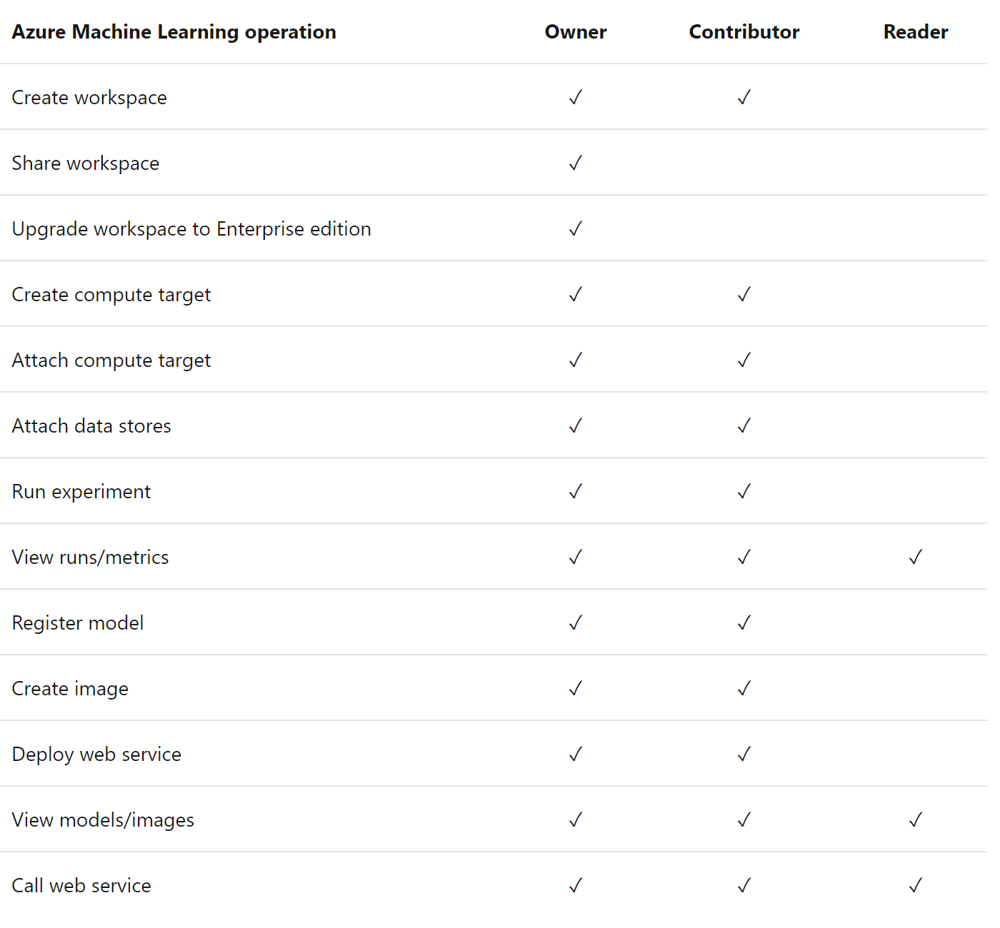

# Infrastructure as Code

This folder contains examples for how to bootstrap your machine learning workflow.
Azure Resource Manager (ARM) templates & Azure ML CLI commands can easily be used to bootstrap and provision workspaces for your data scientists prior to enabling them to begin data preparation & model training.

* **[ARM-Templates](arm-templates)** contains infrastructure-as-code templates and parameter files for two sample environments (dev + test). The use of ARM templates gives you the most flexibility in customizing your Azure resources.
* **[Scripts](scripts)** contains Azure CLI scripts for resource deployment. The use of CLI commands for deployment provides the most lean way to deploy resources to Azure.
* **[Build-and-Release](build-and-release)** contains pipeline definitions for Azure DevOps to automate infrastructure roll out. Included moreover is a PowerShell script that can be used for test deployments of the infrastructure resources.

## Automated roll out of infrastructure

In this section you will learn about how you could use [Azure Pipelines](https://azure.microsoft.com/en-us/services/devops/pipelines/) for the automated deployment of infrastructure. This way of working enables you to incrementally deploy changes to your resources, stage the changes over different environments, and build confidence as your system growths more complex.

### Getting started

Complete the below steps to set up your pipeline for infrastructure roll out.

* Navigate to [Azure DevOps](http://dev.azure.com/) and create a new organization and project. You can also re-use an existing organization and/or project.
* Create a new [service connection](https://docs.microsoft.com/en-us/azure/devops/pipelines/library/service-endpoints?view=azure-devops&tabs=yaml) in Azure DevOps of the Azure Resources Manager connection type. Azure DevOps will authenticate using this connection to make deployments to your Azure Subscription.
* In [deploy-infra.yml](build-and-release/deploy-infra.yml) replace `<your-service-connection-name>` by the name of the service connection that you created in the previous step.
* Some Azure resources require you to use globally unique names across Azure. This holds for example for storage account resources. Adapt resource names in the ARM parameter files to a name that is globally unique. Note that you should update the parameter files for the ML workspace and ML compute resources as well once you update the names of the underlying resources.
* Make a test deployment using the provided powershell script `deploy-infra.ps1`.
* Set up a new pipeline in Azure DevOps with the option to re-use an existing template. Point to the pipeline definition [deploy-infra.yml](build-and-release/deploy-infra.yml) in your repository.
* Run your pipeline from Azure DevOps. On completion, you should see a result like the below.

### Best practices on customizing the templates for your environment and team

* Many teams already have existing resources in their Azure tenant for e.g. Keyvault and Application Insights. These resources can be re-used by Azure Machine Learning. Simply point to these resources in the [Machine Learning Workspace template](arm-templates/mlworkspace/template.json). For ease of modification, we have provided separate templates for each of the resources in this repository.
* In most situations data already resides on existing storage in Azure. The [Azure CLI ML Extension](https://docs.microsoft.com/en-us/azure/machine-learning/reference-azure-machine-learning-cli) allows for a lean way to add storage as a [Datastore](https://docs.microsoft.com/en-us/azure/machine-learning/concept-data) in Azure Machine Learning. The [Azure CLI task](https://docs.microsoft.com/en-us/azure/devops/pipelines/tasks/deploy/azure-cli?view=azure-devops) in Azure DevOps can help you to automate the datastore attachment process as part of the infrastructure roll out.  
* Many teams choose to deploy multiple environments to work with, for example DEV, INT and PROD. In this way infrastructure can be rolled out in a phased way and with more confidence as your system becomes more complex.
* As one rolls out additional infrastructural resources, it becomes valuable to stage changes across the different environments. You could consider to run a set of integration or component tests before rolling out to PRD.
* It is a sound practice to protect the roll out of changes to PRD from originating from branches other than master. [Conditions](https://docs.microsoft.com/en-us/azure/devops/pipelines/process/conditions?view=azure-devops&tabs=yaml) in Azure pipelines can you help to set controls like these.
* One could specify a security group of users that require to give their [approval](https://docs.microsoft.com/en-us/azure/devops/pipelines/process/approvals?view=azure-devops&tabs=check-pass#approvals) to make roll outs to specific environments.
* It is important to note that in the MLOps way of working, we make a separation of concerns between the roll out of infrastructure and the roll out of ML artifacts. Hence the two types are rolled out at different moments and with different automation pipelines.
* Multiple additional security controls (virtual network rules, role-based access control and custom identities) can be applied on the Azure resources that are found in this repository. Controls can be added directly from the ARM templates. Consult the [documentation](https://docs.microsoft.com/en-us/azure/templates/) on Azure Resource Manager to find the possible modifications that can be made to each Azure Resource. As an example on modifications for the template for Azure ML compute, one can find a [template](arm-templates/mlcompute/template-vnet.json) in this repository that adds a SSH user and virtual network controls to the managed compute virtual machines.

# Best practises to organize your workspaces 

* Infrastructure configuration
* Shared resources across Workspaces
* Workspace organization 
* Infrastructure deployment

## Infrastructure configuration
Before we start working with the Azure Machine Learning workspace, there are infrastructure decisions to be made. The following pictures shows the infrastructure component of the Azure Machine Learning workspace: 

Within the Azure Machine Learning Workspace, there are three big decision to be made:

## Who has access to the workspace.
Best practice is to use Role Based Access Control, to grand user access to the workspace. There are three roles available in AML, as in many Azure services, owner, contributor and reader. This is an overview of the standard roles:

In my opinion, these standard roles to not suffice in most enterprise scenario. As a Data Scientist working in the Machine Learning workspace  I should be a contributor, so I can run experiments, create images, attach compute to a run and connect to the data stores. But as a standard contributor, I am also able to create my own compute and create workspaces and deploy models. In most enterprise scenario’s I see that for security/management and cost reason, the data scientist are not allowed to create their own workspaces or compute. And is most scenario’s you only want to be able to deploy models via Azure DevOps, where is will follow the standard dev practices of dev/test and prod environments and model CI/CD. Within Azure Machine Learning you can cerate your own custom roles. Custom roles can have read, write, or delete permissions on the workspace and on the compute resource in that workspace. You can make the role available at a specific workspace level, a specific resource-group level, or a specific subscription level. Best Practice is to not allow data scientist to create new workspaces or compute but let them ask permission through the IT department.

## Data configuration. Which data can be used by the workspace?
Within Azure Machine Learning, we can make connections to Datastores in Azure, for example, to a data lake storage. Within Azure Machine Learning we can connect to multiple data sources. The recommended usage of datastores and datasets we will discuss later. For now, it is good to notice that everyone in the Azure Machine Learning workspace has access to the data that is connected to it. Therefore, when deciding how many workspaces you are going to create, for what purposes and for which usages, I would recommend to be the access to certain data the leading factor. What I mostly see at customers, is that they have a workspace for each solution in each location. This, because most data is protected on a database level also per solution area and per geographical location. Because every individual with access to the Azure ML workspace, has access to the datastores connected to the workspace, it is very important for security reason that this is designed properly and before we start deploying the infrastructure.

## Managed Compute Configuration
Within every workspace, you can make AML compute available for the users within the workspace. Every user within the workspace has access to all the compute. Therefore, it is also very important to think about the available compute within a workspace and how users may use these. What type of compute, how many cores and many different clusters you need in a workspace varies of course widely per scenario. My advice would be to start with a minimum requirement of compute and scale out on request when needed. In most cases, it is also advisable to make sure to code that data scientist write is designed for parallel execution. In many cases, I see customers scale out compute to distribute the workload, while their code or data structure is not parallelizable. This is of course a waste of money. I think it is also good to mention, that the compute needs change over time as a project evolves. What I see a lot happening, is that data science teams start with small, cheap compute clusters (1 or 2 cores) per user in the workspace, for quick experimentation and code development. When the code base is more mature, the teams switch their 6 low cost clusters for maybe 1 or 2 bigger clusters with more memory and cores for example, to scale their solution on the entire datasets or to parallelize the training, in order to save time. My recommendation would be, that if you are in an experimentation phase of the project, you start with many small compute to speed up the development process, and move to more expensive compute with the optimized memory and runtime when scaling the solution.

## Shared resources across workspaces
To work with MLOps and Azure Machine Learning, we need some extra PaaS solutions. These solutions include:
* ML Key Vault
* Application Insights
* Container Registry
* Workspace storage Account

Every workspace in AML can have their own recourses, but I believe it is best practice to share these resources across workspaces as showed in the following picture:

What I see most of my customers do, is that they create 1 Resource Group in Azure for Machine Learning purposes per geo location. Within this resource group, they create multiple Azure Machine Learning workspaces, all designed for different solutions. All these workspaces share the same resources mentioned above. This way, you make it more accessible to share environment/models/metrics across workspaces. They create a separate Resource Group for the management of the ML resources, because this is mostly done from 1 place, where the management for all Azure resources happen.
By using Application Insights and Azure Key Vault across workspace, we create one place for the management of all resources in Azure.
By using the default storage account across workspaces, users can easily share models as .pkl or .onnx files, use common metrics, metadata or feature schemas.
We use Event grids, Azure functions and logic apps across workspace to put actions on events happening in AML workspaces, like triggers when a job fails, or the filtering of certain logs.
By using container registry across workspaces, user can share and reuse already build environments. This way you can lower the costs of container registry, limit the time waiting for new images being build and promote the sharing of recourses. 

