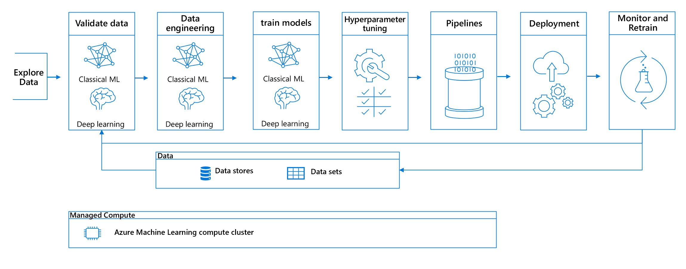
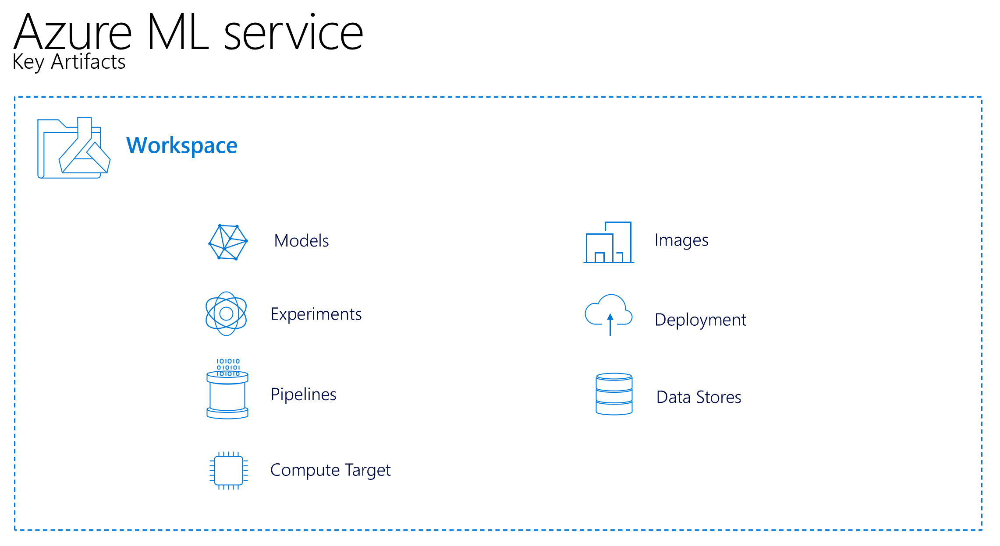

## Lab 1: Introduction ##
This lab is an introduction into the concepts of Azure ML. Before we start implementing the solution in the following labs, we will first explain the concept of Azure ML and the solution that we are going to build.

# Pre-requirements #
1. Finished the setup file [00_setup](https://github.com/miquelladeboer/aml-mlops-workshop/blob/master/labs/00_setup.md)

# Solution overview #
As explained in the introduction in this repo, we will be building a text classification model, using deep learning with Pytorch. The data that we are using is from the `sklearn 20newsgroups`, so the repo is reproducable. In this repo, we build a AML pipeline covering an end-to-end scenario of all steps in the Data Science lifecycle. We will start with the roll out of the infrastructure, then we will perform data exploration, next we will build a porfile of our dataset that we can use for data validation, we will then use the validated data to perform data engineering. Next we will try out different sklearn models or our data. We will start with trying a random forest and then try many different models and compare them with the tracking capabilities of AML. To get better results, we will use deep learning. We will first perform hyper parameter tuning and use the best hyper parameters to train the final model. We will then deploy the model and the pipeline using CI/CD pipelines over our DEV, TEST and PRD evironments and set up model monitoring in Application Insights for active monitoring and automated retraining. We will also build a Power BI report for monitoring data quality and model quality.

We will cover the following building blocks in this lab:

Following these building blocks, we will create the full pipeline and we will explain and use all artifacts of Azure Machine Learning:

